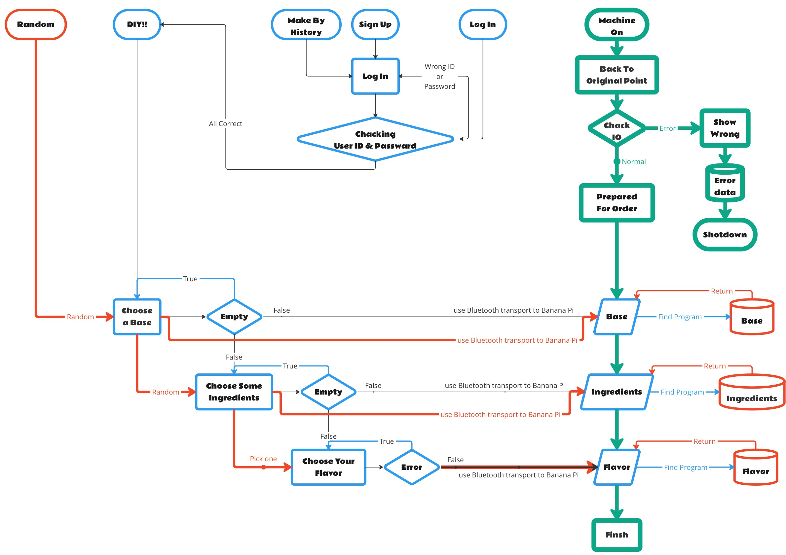

# 大學專題《智慧飲品工坊》

App專案區  
&emsp;&emsp;├ &emsp;&emsp; [AppInventor 版本（測試試用版_有完整功能及未來雛形 ）](https://github.com/AdamLin0626/DrinksMachine/tree/main/ClientApp_AppInventor(完整功能))  
&emsp;&emsp;└ &emsp;&emsp; [AndroidStudio（Kotlin版本）持續撰寫中...](https://github.com/AdamLin0626/DrinksMachine/tree/main/ClientApp_Android(Kotilin)) &emsp;&emsp;  

[UI design by Figma]([https://www.figma.com/design/JpJXJRiiAUezNKl1BZxRH2/DrinksMachine-APP?node-id=0-1&t=ESqcxtQsUz23wJDn-1](https://www.figma.com/proto/JpJXJRiiAUezNKl1BZxRH2/DrinksMachine-APP?node-id=1-21&p=f&t=f7tkqpoAnLhn3m0q-1&scaling=scale-down&content-scaling=fixed&page-id=0%3A1&starting-point-node-id=1%3A146))  
[模型零件](https://github.com/AdamLin0626/DrinksMachine/tree/main/3D_OBJ)  
[自動化機械控制檔案](https://github.com/AdamLin0626/DrinksMachine/blob/main/MachineControlFirmware.py)

---

**專案期間**：2024/9 ~ 2025/2  
**專案分工**：  
&emsp;&emsp; 呂柏毅 &nbsp;&nbsp; 機械手臂程序開發員 | 客戶端系統開發員 | 書面資料製作員  
&emsp;&emsp; 羅仕勛 &nbsp;&nbsp; 機械手臂程序開發員 |  書面資料製作員  
&emsp;&emsp; 林毓翔	&nbsp;&nbsp; 專案發想人 | 客戶端系統開發主負責人 | 跨域整合執行者 | 產品設計師 | 書面資料整合員  
&emsp;&emsp; 蔡睿家	&nbsp;&nbsp; 書面資料製作員  
&emsp;&emsp; 黃筠婷	&nbsp;&nbsp; 書面資料製作員  

**技術工具**：  
&emsp;&emsp; Python、MQTT、MIT App Inventor、MyCobot280 M5、3D列印（FDM）、SolidWorks、PowerPoint  

---

### 專案簡介：
「智慧飲品工坊」是一套結合物聯網與自動化技術的智慧飲品製作系統。使用者可透過 MIT App Inventor 所開發的點餐介面下單，資料經由 MQTT 傳輸至主控端，由 Python 控制 MyCobot280 M5 機械手臂完成飲品材料的自動取用與製作流程。產品外觀與輔助模組以 SolidWorks 設計並以 FDM 技術 3D 列印實作。 
- 以下為專案流程圖(左)及機械運動邏輯流程圖(右):

  
  

            
---

### 成果總結：

- **專案發起與企劃撰寫**：獨立構思專題主題，撰寫完整計畫書與書審簡報（PPT），通過校內審核並獲師長認可。
- **APP 系統設計**：使用 MIT App Inventor 設計點餐介面，支援多種飲品與配料組合，並實作 MQTT 資料封包格式與發送邏輯。
- **機械手臂控制程式**：以 Python 撰寫 MyCobot280 M5 的控制程式，進行關節角度規劃與動作流程設計，實現精準自動取料。
- **產品建模與製作**：使用 SolidWorks 設計客製化夾具、模組支架，並以 3D 列印實作，有效提升整體製作穩定性與機械結構效率。
- **跨平台整合測試**：完成「App 點餐 → MQTT 傳輸 → 機械手臂製作」的流程整合與穩定測試，系統準確率與完成率達 90% 以上。

---

### 學習收穫：

- 全面掌握 IoT 系統架構與前後端通訊流程。
- 實作從無到有的專案管理、技術開發與設計輸出。
- 培養跨領域思考與系統整合能力，強化工程實作與展示能力。
